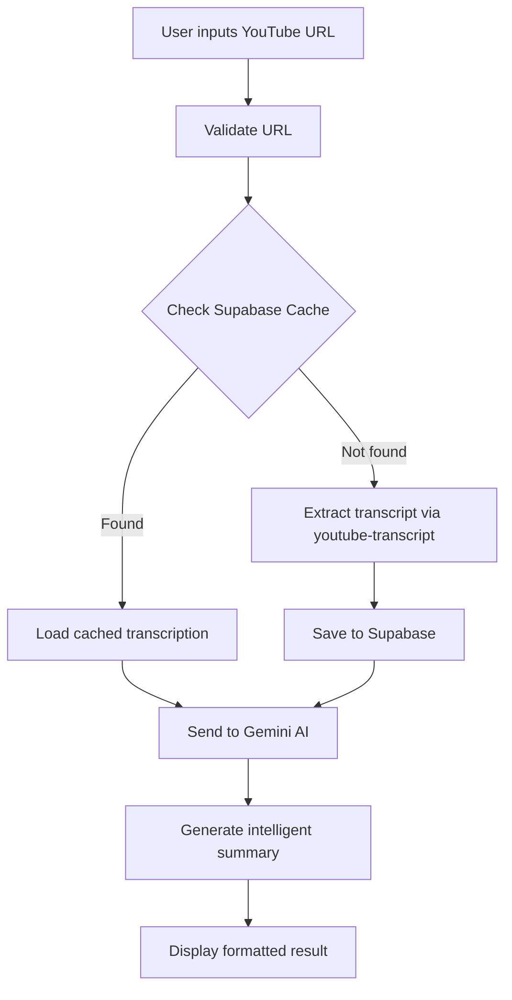

# 🎤 Gemini Transcript - AI-Powered YouTube Transcription

<div align="center">

[](https://gemini-transcript-one.vercel.app)
[](https://chrome.google.com/webstore)
[](LICENSE)

</div>

**AI-powered Chrome extension and web app** that automatically transcribes YouTube videos and generates intelligent summaries using **Google Gemini API**. Perfect for content creators, students, and professionals who need quick video insights.

---

## ✨ Key Features

### 🎯 **Smart Transcription**
- **YouTube video** automatic transcription extraction
- **Real-time processing** with high accuracy
- **Multi-language support** for global content
- **Cached results** to avoid duplicate processing

### 🧠 **AI-Powered Summaries**
- **Google Gemini API** integration for intelligent analysis
- **Contextual summaries** that capture key points
- **Markdown formatting** for easy reading
- **Customizable summary length** and style

### 🚀 **Performance Optimized**
- **Supabase database** for efficient caching
- **React 18** with modern hooks
- **SCSS styling** for responsive design
- **Error handling** and validation

---

## 🛠️ Tech Stack

| Category | Technologies |
|----------|-------------|
| **Frontend** |   |
| **Styling** |   |
| **AI/API** |   |
| **Database** |  |
| **Tools** |   |

---

## 🚦 Quick Start

### Prerequisites
- **Node.js** 16+
- **Google Gemini API** key
- **Supabase** project setup

### Installation

```bash
# Clone the repository
git clone https://github.com/Freddymhs/gemini-transcript.git
cd gemini-transcript

# Install dependencies
npm install

# Set up environment variables
cp .env.example .env
# Add your API keys to .env file

# Start development server
npm run dev
```

### Environment Variables

```env
VITE_GEMINI_API_KEY=your_gemini_api_key_here
VITE_SUPABASE_URL=your_supabase_url
VITE_SUPABASE_ANON_KEY=your_supabase_anon_key
```

---

## 🎯 How It Works



### **Process Flow:**

1. **URL Validation** - Ensures valid YouTube links
2. **Cache Check** - Searches Supabase for existing transcriptions
3. **Transcript Extraction** - Uses `youtube-transcript` for new videos
4. **AI Processing** - Sends to Gemini API for intelligent analysis
5. **Summary Generation** - Creates contextual summaries
6. **Markdown Display** - Presents results with `react-markdown`

---

## 📁 Project Structure

```
src/
├── components/           # React components
│   ├── TranscriptForm/   # URL input and validation
│   ├── VideoPreview/     # YouTube thumbnail display
│   └── SummaryDisplay/   # AI-generated summary
├── helpers/              # Utility functions
│   ├── gemini.js         # Gemini API integration
│   ├── supadata.js       # Supabase operations
│   └── validation.js     # URL validation
├── styles/               # SCSS stylesheets
└── App.jsx              # Main application component

public/
├── manifest.json         # Chrome extension manifest
└── icons/               # Extension icons
```

---

## 🎨 Features in Detail

### **Smart Caching System**
- Prevents duplicate API calls for the same video
- Supabase integration for persistent storage
- Optimized query performance

### **AI Summary Generation**
```javascript
// Example Gemini integration
const getGeminiAnswer = async (transcript) => {
  const prompt = `Analyze and summarize this YouTube transcript: ${transcript}`;
  return await geminiAPI.generateContent(prompt);
};
```

### **Chrome Extension Support**
- Browser extension for seamless YouTube integration
- One-click transcription while watching videos
- Popup interface for quick access

---

## 🚀 Available Scripts

```bash
# Development
npm run dev              # Start dev server with hot reload
npm run build           # Build for production
npm run preview         # Preview production build

# Chrome Extension
npm run build:extension # Build Chrome extension
npm run package        # Package extension for store

# Utilities
npm run lint           # Run ESLint
npm run format         # Format code with Prettier
```

---

## 🌐 Live Demo

Try the web app: **[gemini-transcript-one.vercel.app](https://gemini-transcript-one.vercel.app)**

### **Example Usage:**
1. Paste any YouTube URL (e.g., tech talks, tutorials, interviews)
2. Click "Generate Transcript"
3. Get AI-powered summary in seconds
4. Copy or export results

---

## 🎯 Use Cases

### **For Students:**
- 📚 Summarize lecture videos
- 📝 Create study notes from educational content
- 🎓 Extract key concepts quickly

### **For Content Creators:**
- 🎬 Analyze competitor content
- 📊 Extract video insights
- 💡 Generate content ideas

### **For Professionals:**
- 🏢 Summarize conference talks
- 📈 Extract business insights
- ⏱️ Save time on long videos

---

## 🤝 Contributing

Contributions are welcome! Please feel free to submit issues and pull requests.

### **Development Guidelines:**
- Follow existing code style
- Add tests for new features
- Update documentation
- Test Chrome extension functionality

---

## 📄 License

This project is licensed under the **MIT License** - see the [LICENSE](LICENSE) file for details.

---

## 👨‍💻 Developer

**Freddy Huaylla** - *Fullstack Developer*
- 🌐 Portfolio: [fmarcos.dev](https://fmarcos.dev)
- 💼 LinkedIn: [freddymhs](https://linkedin.com/in/freddymhs)
- 📧 Email: fmarcosdev@gmail.com

---

<div align="center">

**⭐ Star this repo if it helped you!**

*Powered by Google Gemini AI and built with React*

</div>